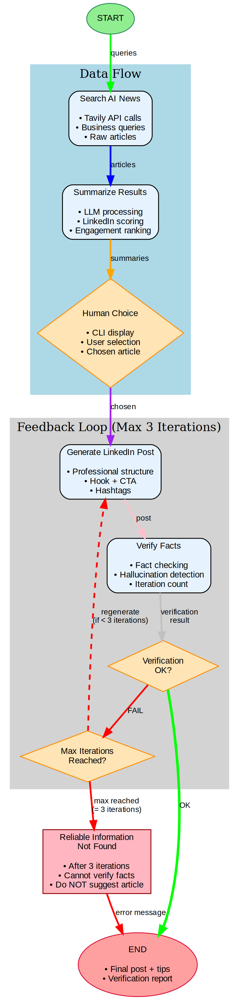

## Agentic AI vs Generative AI Demo (LangGraph + Tavily)



This project demonstrates an agentic workflow using LangGraph that:
- Searches for LinkedIn-engaging AI news using Tavily (business impact, career relevance, industry trends)
- Summarizes the 3 most engaging results with professional focus
- Pauses for a human to select the most engaging story for their network
- Crafts a high-engagement LinkedIn post with call-to-action and professional insights

### Prerequisites
- Python 3.10+
- Environment variables:
  - `OPENAI_API_KEY`
  - `TAVILY_API_KEY`

### Setup
```bash
python -m venv .venv
source .venv/bin/activate
pip install -r requirements.txt
```

**Important**: Always activate the virtual environment before running the CLI:
```bash
source .venv/bin/activate
```

Create a `.env` file with your API keys:
```bash
cat > .env << 'EOF'
OPENAI_API_KEY=sk-your-openai-key-here
TAVILY_API_KEY=tvly-your-tavily-key-here
MODEL_NAME=gpt-4o-mini
MAX_TOKENS=800
TEMPERATURE=0.3
EOF
```

Or set environment variables directly:
```bash
export OPENAI_API_KEY="sk-your-openai-key-here"
export TAVILY_API_KEY="tvly-your-tavily-key-here"
```

### Run
```bash
# Make sure you're in the virtual environment
source .venv/bin/activate
python -m src.cli
```
You'll be shown 3 LinkedIn-optimized summaries and asked to choose the most engaging one. The tool then generates a professional LinkedIn post with:
- Compelling hook and business insights
- Call-to-action questions for engagement
- Professional hashtags
- Fact verification report
- Engagement tips for maximum reach

### Features
- **LinkedIn-Focused Search**: Targets business impact, career opportunities, and industry trends
- **Engagement Scoring**: Ranks news by professional relevance and discussion potential
- **Professional Post Structure**: Hook → Insight → Personal Touch → CTA → Hashtags
- **Fact Verification**: Ensures all claims are grounded in source material
- **Engagement Tips**: Provides best practices for LinkedIn posting

### Workflow Visualization
The project includes a Graphviz workflow diagram showing the complete LangGraph workflow with feedback loop:
```bash
# Generate the workflow diagram
python graphviz_workflow.py
```
This creates `langgraph_workflow.png` and `langgraph_workflow.svg` showing:
- Complete workflow from search to final post
- Feedback loop for fact verification (max 3 iterations)
- Decision points and error handling
- Data flow between nodes

### Notes
- The LinkedIn post is constrained to facts extracted from the source article to avoid hallucinations
- Tavily search is used for fresh results; ensure your key has quota
- Posts are optimized for professional networks and business discussions
