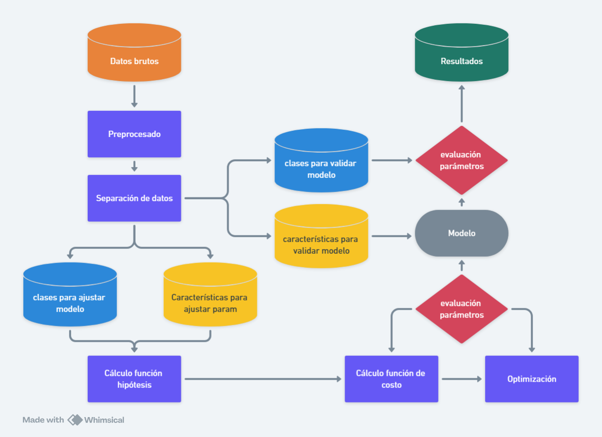

# Regresión Logística con Solapamiento

Este código implementa un modelo de **regresión logística** para clasificar **naranjas** y **mandarinas** en función de su diámetro y peso. Además, incluye una animación del proceso de optimización por descenso de gradiente.

Por razones prácticas he distribuido el código en dos celdas, la primera, está principalmente dedicada a pintar el proceso iterativo de ajuste de la frontera de decisión conforme se ajustan los parámetros. La segunda celda contiene lo que viene siendo el código estándard de un clasificador de ML, separación de datos, ajuste de parámetros usando datos de calibración y finalmente, validación del modelo usando datos de prueba. 

## La primera celda del [cuaderno](https://github.com/DrAnonimo/IdeasArtificiales/blob/main/Anatom%C3%ADaAlgoritmoIA/MandarinasNaranjas-RegresionLogistica.ipynb)

1. **Generación de datos:** Se crean muestras de naranjas y mandarinas con cierto solapamiento utilizando distribuciones normales.
2. **Normalización:** Se estandarizan el diámetro y el peso con la estandarización Z-score.
3. **Implementación de la regresión logística:**
   - Se define la **función sigmoide** para transformar valores lineales en probabilidades.
   - Se define la **función de costo** basada en entropía cruzada.
   - Se implementa el **descenso de gradiente** para optimizar los parámetros del modelo.
4. **Ajuste de parámetros del modelo:** Se ajustan los pesos, θ, mediante iteraciones del descenso de gradiente.
5. **Visualización del proceso de optimización:**
   - Se grafica la frontera de decisión en cada iteración.
   - Se crea una animación de la convergencia del modelo.
   - Se guarda la animación como un archivo GIF.

## Requisitos

Para ejecutar este código, se necesitan las siguientes librerías:

```python
import numpy as np
import matplotlib.pyplot as plt
from matplotlib.animation import FuncAnimation
```

## Resultados
- Se observa la convergencia del modelo a medida que la función de costo disminuye.
- Se produce una animación que muestra la optimización iterativa de la frontera de decisión.

## La segunda celda del [cuaderno](https://github.com/DrAnonimo/IdeasArtificiales/blob/main/Anatom%C3%ADaAlgoritmoIA/MandarinasNaranjas-RegresionLogistica.ipynb)

Este código implementa un modelo de **regresión logística** para clasificar **naranjas** y **mandarinas** en función de su diámetro y peso. Además, visualiza la frontera de decisión y evalúa el modelo mediante una matriz de confusión.

## Pasos del código
1. **Usamos los datos generados en la celda anterior:**

2. **División del conjunto de datos:**
   - Se seleccionan las características relevantes (diámetro y peso).
   - Se dividen los datos en conjuntos de entrenamiento (70%) y prueba (30%).

3. **Ajuste de parámetros del modelo:**
   - Se entrena una **regresión logística** con los datos de entrenamiento.

4. **Visualización de la frontera de decisión:**
   - Se crea una malla de puntos y se predicen las clases.
   - Se grafica la frontera de decisión junto con los puntos de datos.

5. **Evaluación del modelo:**
   - Se predicen las etiquetas en el conjunto de prueba.
   - Se calcula y muestra la **matriz de confusión** para evaluar el rendimiento del clasificador.

## Requisitos

Para ejecutar este código, se requieren las siguientes librerías:

```python
from sklearn.model_selection import train_test_split
from sklearn.linear_model import LogisticRegression
from sklearn.metrics import confusion_matrix, ConfusionMatrixDisplay
import numpy as np
import matplotlib.pyplot as plt
```

## Resultados

- Se genera una **frontera de decisión** que separa las clases de naranjas y mandarinas.
- Se observa el **desempeño del modelo** mediante la matriz de confusión, que muestra la cantidad de aciertos y errores en la clasificación.
