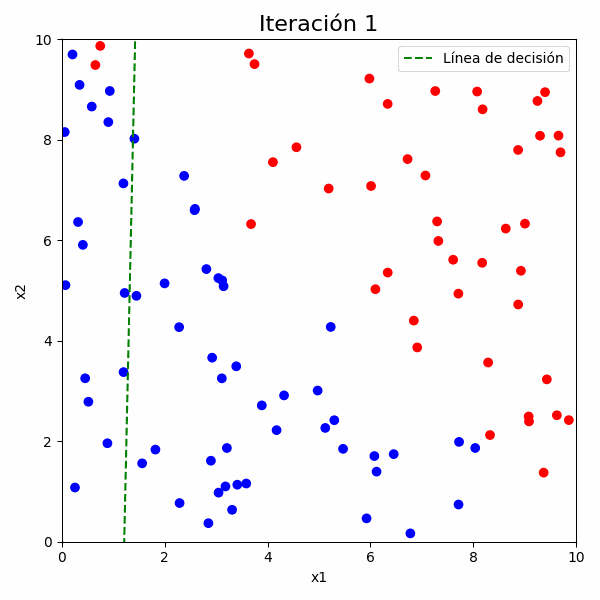

# Perceptrón Simple con Visualización de Aprendizaje

Este repositorio contiene una implementación de un **perceptrón simple** para clasificación binaria en dos dimensiones. El código genera un conjunto de puntos aleatorios, los clasifica mediante un perceptrón y muestra la evolución de la línea de decisión a lo largo del entrenamiento mediante un **GIF**.

<p align="center">
  
</p>

## Descripción del Código

El script realiza los siguientes pasos:
1. **Generación de datos**: Se crean 100 puntos aleatorios en un espacio 2D y se asignan etiquetas en función de la suma de sus coordenadas.
2. **Inicialización del perceptrón**: Se generan pesos y sesgo aleatorios.
3. **Entrenamiento**: Se actualizan los pesos y el sesgo utilizando la regla del perceptrón.
4. **Visualización**:
   - Se genera un gráfico con la línea de decisión en cada iteración.
   - Se guardan estas imágenes y se combinan en un GIF.
5. **Evaluación**:
   - Se calcula y visualiza la matriz de confusión al final del entrenamiento.

## Requisitos

Para ejecutar este código, asegúrate de tener instaladas las siguientes librerías de Python:

```bash
pip install numpy matplotlib scikit-learn seaborn imageio
```

## Uso

Ejecuta el script en Python:

```bash
python perceptron.py
```

Esto generará el archivo `perceptron_evolucion.gif`, que muestra cómo evoluciona la línea de decisión durante el entrenamiento.

## Ejemplo de Resultados

- **Evolución de la Línea de Decisión**
  

- **Matriz de Confusión Final**
  Se muestra la precisión del modelo en clasificar los puntos de prueba.

## Contacto
Si tienes dudas o sugerencias, no dudes en contribuir o contactarme.

---
© 2025 - Proyecto de Perceptrón Simple

